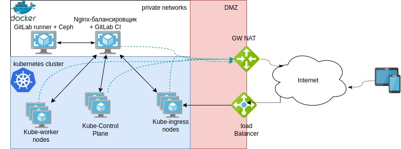

Манифест для подготовки инфраструктуры в yandex cloud
==============

Требуется
---------

* ОС семейства Linux
* Terraform >= 0.13
* Аккаунт в YC

Переменные
----------

В переменные ОС необходимо добавить:

YC_TOKEN - токен доступа (export TF_VAR_YC_FOLDER_ID=$(yc config get folder-id))

YC_CLOUD_ID - ID облака  (export TF_VAR_YC_CLOUD_ID=$(yc config get cloud-id))

YC_FOLDER_ID - ID каталога (export TF_VAR_YC_TOKEN=$(yc iam create-token))

При инициации terraform необходимо указать: access_key и secret_key бакета для хранения конфигурации. 